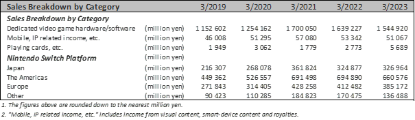
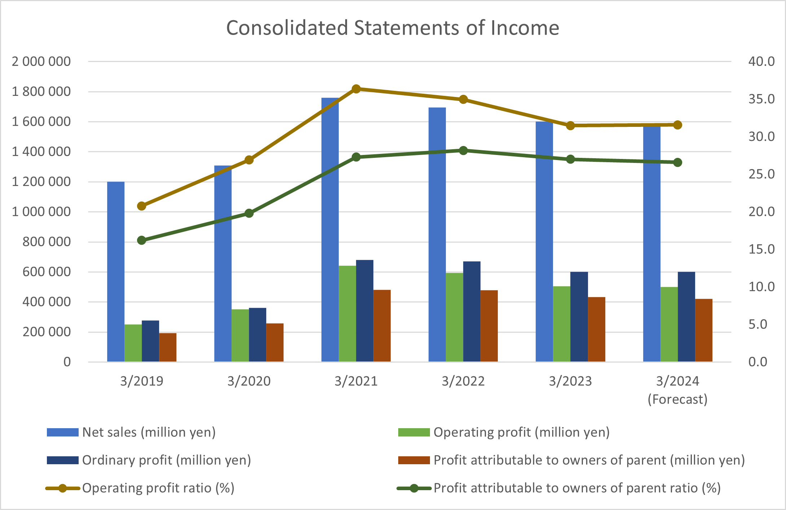
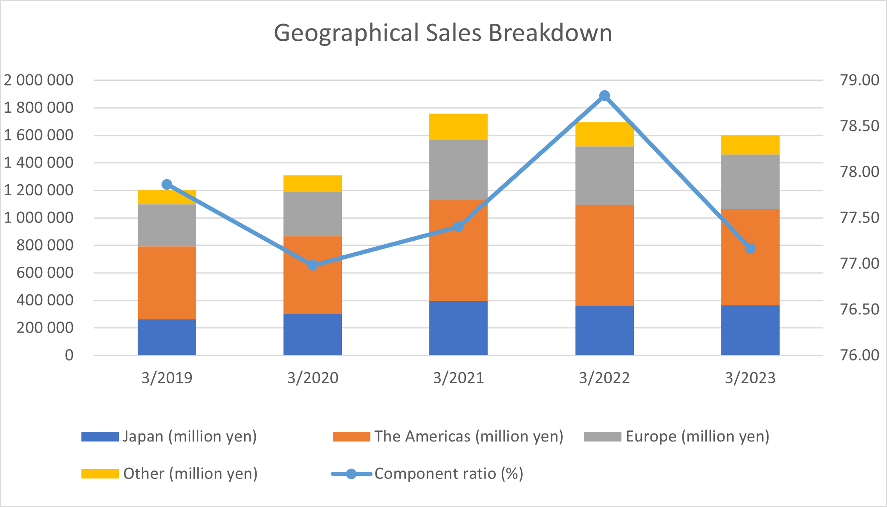
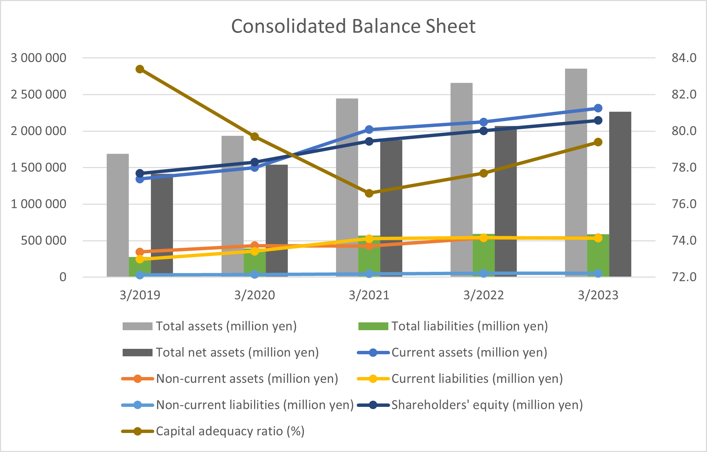
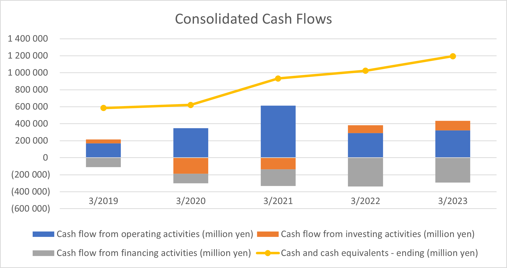

## 2. Financial Analysis

In this part, we provide a concise financial analysis for the Nintendo company. As Nintendo is set in Japan, we provide all the financial information in Japanese Yen unless stated otherwise. Also, we need to take into consideration the two following assumptions:

- The Consolidated Financial Statements are prepared in accordance with accounting standards generally accepted in Japan. Therefore, some terminology and conventions differ in certain cases from the common conventions.
- The estimates that appear in certain parts of the financial analysis are made based on past results and likelihood of future events, with uncertainties that are inherent in the estimates.

Moreover, we select and highlight only some of the key figures in the following analysis. For further details and the main source of information for the following analysis see the attached spreadsheet and a 2023 annual report of the Nintendo company.

The structure of this section is the following. First, we provide a Profit/Loss (P/L) Analysis. Then we proceed with the Balance Sheet (B/S) Analysis, followed by a brief Cash Flow (CF) Analysis. We conclude this section with an additional analysis of the key financial ratios and a Dupont decomposition.

### 1. Profit/Loss (P/L) Analysis

In the following figure, we can see the division and attributable sales of the Nintendo company’s products. The biggest share on the sales have the video game hardware and software, of which the Nintendo Switch platform is the key component.

Next, we briefly summarize the Sales Development:

- **Nintendo Switch Business:** Strong sales for Pokémon Scarlet, Pokémon Violet, and Splatoon 3 games (as a physical medium). However, overall decline in hardware unit sales by 22.1%, impacted by semiconductor shortages and consequent production issues.
- **Digital Business:** Downloadable software sales (including online games) and Nintendo Switch Online revenue increased, contributing to digital sales growth. Digital sales reached ¥405.2 billion, up 12.7% YoY.
- **Mobile and IP Business:** Overall sales declined 4.3% YoY, impacted by a decrease in income from smart-device content.
- **Playing Cards, etc.:** Although only a relatively small share of the company’s production, sales increased significantly by 105.1% YoY.

Now we connect the sales to profit. In the following figure, we can see the evolution of sales and profit from 2019 to 2023, including a forecast for 2024.

Overall, we see that the Net Sales declined from ¥1,695,344 million in the previous fiscal year (2022) to ¥1,601,677 million, which is a decrease of 5.5%. Also, Gross Profit decreased from ¥946,044 million to ¥885,440 million, with a gross profit margin of 55.3%. Since the gross profit margin is the proportion of remaining revenue after deducting the cost of goods sold (COGS), compared to the year 2019 where it was about 42%, this is a significant improvement. Moreover since the year 2021, the Gross Profit Margin remains relatively stable between 55 and 56 percent.

Competitors margin? Sony 27.41%; EA about 76%, but lower net profit margin of 13%...

#### Profitability

Overall, in the recent years, we can see a financial performance decline. Although from 2019 to 2021 the overall profitability was increasing, from 2021 to 2023 profitability growth reversed, and we see a slow decline in the key figures. The net sales, operating profit, ordinary profit, and profit attributable to owners of the parent decreased YoY. If we look at the two of those measures, we can see the magnitude of the profitability decline:

- **Operating Profit:** Decreased from ¥592,760 million to ¥504,375 million, a decrease of 14.9%.
- **Profit Attributable to Owners of Parent:** Decreased by 9.4% to ¥432,768 million.

The operating profit decreased mainly due to increased research and development and advertising expenses.

#### Foreign Exchange (FX) Risk

Nintendo faces FX risk due to more than 75% of total sales generated outside Japan as can be inferred from the Component ratio in the below graph. This might have an impact on financial performance due to exchange rate fluctuations.

#### Competitors' Comparison

- Additional market research needed for competitive analysis.
- Potential main competitors: 
    - Sony Interactive Entertainment (SIE), Microsoft Corporation, Electronic Arts (EA), Activision Blizzard, Ubisoft Entertainment, Tencent Holdings

### 2. Balance Sheet (B/S) Analysis

#### Main Assets and Liabilities

- **Total Assets:** Increased from ¥2,662,384 million to ¥2,854,284 million.
- **Total Liabilities:** Slightly decreased from ¥593,074 million to ¥587,818 million.

#### Capital Structure and Indebtedness

- **Shareholders' Equity:** Increased to ¥2,146,798 million.
- **Debt Ratios:**
  - Debt-to-Assets Ratio: Total Liabilities/Total Assets ≈ 20.78%
  - Debt-to-Equity Ratio: Total Liabilities/Shareholders’ Equity ≈ 27.61%

These ratios tell us the proportion of debt in relation to the company's total assets and shareholders' equity:
- The Debt-to-Assets Ratio of approximately 20.78% suggests that about 20.78% of the company's total assets are financed by debt.
- The Debt-to-Equity Ratio of approximately 27.61% indicates that for every yen of equity, the company has about 0.28 yen of debt.
- Higher capital adequacy ratios signify rather stable financial position.

#### Concentration vs Diversification

- **Revenue Concentration:** High share of profits related to one product – Nintendo Switch. Therefore, overall company performance is prone to variability heavily based on this product.
- **Diversification:** Portfolio includes dedicated video game platforms, mobile/IP-related business, and playing cards. This is good since there is lower risk if focused only on physical products or just software.

#### Competitors/Peer Comparison

- Detailed information on competitors not yet available.

#### Off-Balance Sheet Items

- No specific information on off-balance sheet items is given.

### 3. Cash Flow (CF) Analysis

#### Stability, Sustainability, Liquidity

- **Cash and Cash Equivalents:** Increased by ¥171.8 billion during the fiscal year.
- **Cash Flow from Operating Activities:** Positive cash flow, contributing to an increase in cash and cash equivalents.
- **Net Cash from Financing Activities:** Decreased, influenced by payments of cash dividends and purchase of treasury shares.

#### Strong Financial Performance

Overall, the stability and sustainability of Nintendo's cash flow seem positive. However, we additionally compute one liquidity ratio figure for a more comprehensive assessment:

- **Current Ratio:** Current Assets/Current Liabilities ≈ 4.34
  - This liquidity ratio indicates that the company has a strong ability to cover its short-term liabilities with its current assets. A current ratio and/or quick ratio well above 1 suggest a comfortable liquidity position. Overall, the Nintendo company has a strong short-term liquidity.

### 4. Additional Financial Analysis

#### Ratio Analysis (Du Pont Decomposition)

The Du Pont analysis decomposes the Return on Equity (ROE) into three components: Net Profit Margin, Asset Turnover, and Equity Multiplier. Now we calculate those ratios:

1. **Net Profit Margin:**
   - Net Profit Margin = Net Profit/Net Sales × 100 ≈ 27.0%
2. **Asset Turnover:**
   - Asset Turnover = Net Sales/Average Total Assets ≈ 0.6 times
3. **Equity Multiplier:**
   - Equity Multiplier = Total Assets/Shareholders’ Equity ≈ 1.33 times
4. **Return on Equity (ROE):**
   - ROE = Net Profit Margin × Asset Turnover × Equity Multiplier ≈ 0.18 or 18%

A brief analysis of Nintendo's profitability, efficiency, and leverage based on the calculated figures:

- The Net Profit Margin of approximately 27.0% indicates that Nintendo retains 27 cents from every yen of sales as profit. A higher net profit margin means higher profitability.
- The Asset Turnover of approximately 0.6 times suggests that for every yen of assets, Nintendo generates 60 cents in sales. It measures the efficiency of asset utilization in generating revenue.
- The Equity Multiplier of approximately 1.33 times indicates that Nintendo's assets are funded 33% by equity, reflecting the level of financial leverage.
- The resulting ROE of approximately 18% signifies the overall return generated for shareholders, with respect to the profitability, efficiency, and leverage. It indicates the effectiveness of management in using equity to generate profits.

#### Additional Ratio Analysis

- **Return on Assets (ROA):** 16.1%
- **Asset Turnover (Alternative Calculation):** 0.56 times
- **Return on Investment (ROI):** 15.2%
- **Financial Leverage (Equity Multiplier - Alternative Calculation):** 1.25 times

These additional ratios provide a more detailed view of Nintendo's financial performance, including profitability, efficiency, leverage, and liquidity:

- **Return on Assets (ROA) of 16.1%** indicates how efficiently the company is utilizing its assets to generate profit. A higher ROA suggests better asset utilization.
- **Asset Turnover (Alternative Calculation):** An alternative measure of how efficiently assets are used to generate sales, indicating that Nintendo generates 56 cents in sales for every yen of assets.
- **Return on Investment (ROI) of 15.2%** measures the return generated on total assets. Similar to ROA.
- **Financial Leverage (Equity Multiplier - Alternative Calculation):** Another measure of leverage, indicating the extent to which assets are funded by equity, suggesting that assets are funded 25% more by equity than the equity multiplier alone indicates.

In conclusion, Nintendo's financial performance shows a decline in certain key areas. However, the company's strong cash position and stability in digital sales indicate resilience in the face of challenges. (But a more detailed analysis, including benchmarking against industry peers, is necessary for a more complete evaluation.)

## Project

- Project: digital product connected to Pokemon cards because the cards are an increasing trend… or improvement of the Pokemon TCG online – based on cards but not yet well-utilized. Should allow for card trading, buying online cards, etc.

